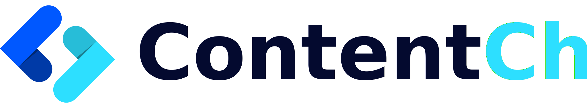

<div align="center">
  
</div>

Angular Starter for [ContentChef - Headless CMS](https://www.contentchef.io/)
===========================

[ContentChef](https://www.contentchef.io/) is an Headless CMS designed to accelarete the development of modern,cross channel digital products.

This starter is a sample [Angular](https://angular.io/) integrated with our Delivery API using the [ContentChef Typescript SDK](https://github.com/ContentChef/contentchef-node)

# Requirements

In order to use make this starter work, you will need

* An active ContentChef account (sign up for a 30-day free trial [here](https://www.contentchef.io/registration))
* Node JS >= 10.13.0
* NPM >= 6.11.0

# Clone & Installation

Clone the starter repo and install all the deps

```bash
    git clone git@github.com:ContentChef/angular-starter.git
    cd angular-starter
    npm install
```

Get your SpaceID, Online API Key from your dashboard home page.


Open `./src/app/contentChef.ts` and copy your data in the clinet configuration and use "example-ch" for your channel now.

```javascript
export class ContentChefService {
    constructor() {
        this.onlineChannel = configure({
            spaceId: '<your spaceId>'
        }).onlineChannel('<your online api key>', 'example-ch');
    }
}
```

You are now ready to start your angular app

```bash
npm run start
```

Enjoy!

You can now visit [https://localhost:4200/sites](https://localhost:4200/sites) and see the list of content fetched from Content Chef!

To Learns More
===========================

* [ContentChef Website](https://wwww.contentchef.io)
* [ContentChef Docs](https://docs.contentchef.io)
* [ContentChef Blog](https://www.contentchef.io/blog)
* [Angular](https://angular.io)